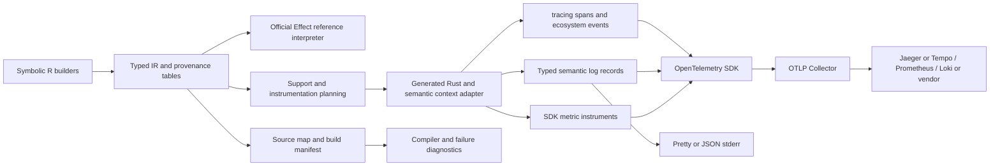

# Observability, logging and source diagnostics

[Roadmap](../PLAN.md) · [Research and checked sources](research/observability.md) · [Runtime lowering](runtime-lowering.md) · [Compiler API](compiler-api.md)

This is the selected design direction, finalized 2026-10-01. The compiler supports synchronous Boolean/u64 computations and Foldkit Query evaluation. Explicit builder provenance, generated Rust ranges and mapped build diagnostics are now [implemented](source-maps.md#implemented-foundation); native logging, tracing, metrics, logical failure stacks and automatic source-map producers remain proposed.

## Recommended architecture

Make observability a compiler-supported semantic capability with replaceable sinks. Keep source provenance available independently of telemetry export. Use Rust `tracing` for native spans/events and ecosystem integration, OpenTelemetry's SDK for trace/log/metric collection, and OTLP to a Collector for export. Reuse official Effect Logger/Tracer/Metric and v4's built-in OTLP modules for the reference interpreter and compiler process.

The native adapter should be small: preserve Effect context, logging records and failure annotations; supply compiler source locations; map those records to established Rust APIs. Do not implement another scheduler, telemetry SDK, wire protocol, storage system or dashboard. Compile instrumentation away only when a selected profile proves that nobody can observe it.



Compiler activity and generated application activity use separate providers/resources. A build trace describes check/derive/plan/build; it must not become the parent of application requests merely because the compiler launched an executable.

## Four distinct kinds of information

| Kind                       | Purpose                                                                                      | Lifetime and ownership                                                                  |
| -------------------------- | -------------------------------------------------------------------------------------------- | --------------------------------------------------------------------------------------- |
| Semantic identities        | Identify operations, witnesses, service/runtime implementations and evidence                 | Immutable typed references; changing debug labels does not change semantics             |
| Source/provenance metadata | Explain which authored function, expression occurrence and transform produced generated code | Build artifacts and compact runtime IDs; independent of exporter configuration          |
| Dynamic execution context  | Carry current span, log annotations, log-span timers, logical frames and later fiber context | Lexical/request/task lifetime; copied/shared according to the supported Effect contract |
| Exported records           | Logs, spans, metrics, diagnostic renderings                                                  | Bounded processors and configured sinks; redacted/serialized at a defined boundary      |

An operation ID is not a source occurrence ID. A trace ID is not a request ID. An OTel instrumentation scope is a producer identity, not an Effect resource Scope. A Rust thread ID is not a logical fiber ID. Keep all of these explicit in types, schema and explanations.

## Source metadata and generated artifacts

Introduce immutable provenance tables alongside IR, rather than mutable metadata on semantic operation objects. The initial record should describe:

- `SourceFile`: normalized workspace-relative path, content hash and optional source-map chain. Absolute machine paths and full source contents are excluded from production telemetry by default.
- `SourceSite`: file, line/column/range when known, author-visible name, function definition site and optional invocation site. Mark location precision as explicit, mapped, captured, or unknown.
- `Origin`: links from authored occurrences through normalized/lowered nodes to generated Rust functions/ranges. Include transformation kind and related origins where a rewrite combines nodes.
- `BuildIdentity`: program/compiler/IR schema versions, source revision when supplied, target/profile, selected adapters, lockfile/dependency digest and artifact identity.

Keep semantic reference identity intact. Assign deterministic occurrence IDs for unchanged inputs within a specified build algorithm; do not claim arbitrary edits preserve IDs. Derive artifact identity from canonical inputs, not JavaScript Symbol descriptions or randomized trace IDs. External telemetry uses build identity plus occurrence ID to resolve a site unambiguously.

A shared Expr DAG may have several authoring/use sites. Model definition and use-edge provenance separately. Lowering a shared helper must retain the calling occurrence as well as the helper's definition origin. Compiler-generated helpers are hidden in the default logical rendering, but visible in an expanded native diagnostic. Optimizations must retain original sites even when operations inline, fuse, or disappear. Provenance does not force tracing every node or prevent optimization; preservation of _observable_ event/frame boundaries does.

### Capture without widening source syntax

Initially accept explicit source-site/name annotations through immutable authoring combinators. `R.fn(...).pipe(R.Source.named("loadUser"), R.Source.at(site))` illustrates the implemented explicit annotation shape; `R.Source.use` distinguishes use occurrences. Focused factories should also support expression/computation occurrence metadata without object spreading or user casts.

Optionally capture a builder's JavaScript call stack once at authoring in development. Map it through available bundler/transpiler source maps and remove internal builder frames. It is best-effort: stack formats, bundling, browser engines and transform pipelines differ. It cannot reliably discover every callback expression's exact column. Never invent a TypeScript line from a generated JavaScript/Rust line. Explicit metadata and named boundaries remain usable when automatic capture is unavailable. An optional metadata-only source transform can add exact sites to the same tables during milestones 2–3; general syntax widening remains later. See [authored-site acquisition](source-maps.md#acquiring-authored-sites).

### Artifact contract

[Source maps and authored diagnostics](source-maps.md) supplies the detailed contract: explicit coordinate units and precision, JS map composition, a provenance-aware Rust writer, exact generated range tables, optional v3 projections, rustc JSON mapping and native symbol lookup. MagicString is optional AST-located JS editing tooling; it does not derive IR-to-Rust origins. Implement provenance/emission before automatic metadata annotation, without widening source syntax.

Plan a versioned `reffect.sources.json` mapping authored sites and generated ranges, plus a build manifest identifying compiler/profile/adapters/dependencies and debug-symbol identity. Runtime builds embed only the IDs/names/locations needed by the selected diagnostics profile. Optionally retain full source content in a developer-only artifact.

Extend Artifact/Cargo writing deliberately to support auxiliary files; GeneratedFiles now retains Cargo.toml, src/lib.rs and src/main.rs plus validated optional auxiliary files. The native runner's scalar stdout protocol must not be changed silently. Add a separately versioned diagnostic envelope/companion mode when it can carry failure annotations; retain the existing scalar mode. Emit structured compiler diagnostics with primary/related source sites and stable codes, keeping the existing IR path as a fallback.

Maintain the chain TypeScript → transformed JavaScript, authored IR occurrence → generated Rust, and optional Rust debug symbols → native address. These are distinct maps. Rust cannot use `#[track_caller]` or its built-in source metadata to infer TypeScript locations. Source-map lookup belongs in CLI/editor/crash tooling, not in every hot-path event.

## Stack traces and failure metadata

Offer three complementary views:

| View                 | What it answers                                                                              | How to obtain it                                                          |
| -------------------- | -------------------------------------------------------------------------------------------- | ------------------------------------------------------------------------- |
| Logical Effect stack | Which authored functions, continuations and semantic boundaries led to failure/interruption? | Compiler site IDs and explicit frame context, rendered against provenance |
| Native backtrace     | Where did Rust actually panic or capture an OS-thread stack?                                 | `std::backtrace`, symbols/debug information and offline symbolization     |
| Distributed trace    | Which services/requests/spans participated over time?                                        | Span context, propagation and exported OTel spans/links                   |

A distributed span tree is not a failure stack. Native backtraces do not reconstruct an async Effect stack after task migration/inlining, and often show generated helpers. Successful trace sampling must not determine whether an error has useful logical frames.

Attach source origin and a bounded logical frame snapshot **at the failure site**, before unwinding/restoring context. Carry annotations separately from the typed payload. Propagation adds meaningful named boundary/call-site frames without allocating a frame for every arithmetic operation. Preserve the actual failing branch, not all static branches, and keep invocation frames distinct for shared code. Track omitted frame count explicitly when a configured limit truncates a stack.

In later Cause-capable profiles, associate frames with individual reasons and preserve typed failure, defect, interruption and interruptor-origin distinctions. Do not flatten everything into a string or change `E` into an exception. Effect RC.118 exposes Cause.StackTrace/InterruptorStackTrace and parent-linked lazy StackFrames; use this as the semantic reference, while accepting different engine/native stack text. Exact source annotations need their own conformance evidence rather than being omitted from payload-only tests.

The current `Result<A,E>`/scalar profile stays valid. When annotations are observable, select an internal failure representation carrying payload plus metadata and a declared adapter at public boundaries. Do not mutate user errors, change RPC error Schema or insert debug fields into wire payloads. Preserve a raw-payload companion boundary for existing native interfaces and version any richer runner envelope. A backend that cannot preserve requested Cause observations must reject that profile.

Capture native backtraces at panics or configured diagnostic boundaries, not on every typed domain failure. `Backtrace::capture` can be disabled/unsupported and costs memory/time; `force_capture` is an explicit debugging choice. Symbol availability is a packaging contract: development keeps useful symbols; production may store symbols privately with a matching artifact ID. Stable std provides formatted capture, not a guaranteed stable structured-frame API. Do not depend on nightly frame iteration for the base profile.

The top-level panic/task-failure handler can emit a bounded defect diagnostic and best-effort local record. It must respect the selected panic policy; abort, SIGKILL, process crash and some out-of-memory paths cannot guarantee flush or finalization. Catching every panic into a typed failure would change semantics and is not this design.

## Logging semantics and sinks

Add explicit computation nodes for logging, scoped log annotations, level/filter selection and log-span timers. Logging is an effect: ordering, branch selection, emission count, current annotations and installed sink are observable. A custom logger may inspect records. The compiler must not hoist, duplicate, memoize or drop those nodes as though they were pure Expr. A known no-op logger allows erasure only under verified preconditions, including evaluation behavior of payload expressions.

Start with static message/event names and checked Boolean/u64 attributes, then admit strings/records through their native representations. Logging needs a Unit result witness; neither Unit nor general native string/record representations are supplied by the current synchronous profile. Arbitrary JS objects, custom formatting callbacks and custom Logger implementations require an explicit supported adapter or refusal. The future `R.Log` surface should mirror the supported parts of official Effect logging, not invent a second application framework.

An illustrative JSON record (field names are proposed) is:

```json
{
  "schema": "reffect.log@1",
  "level": "Info",
  "event": "request.completed",
  "body": "Request completed",
  "attributes": { "rpc.method": "getUser", "outcome": "success" },
  "source": { "build": "example-build", "site": "site-42" },
  "traceId": "0123456789abcdef0123456789abcdef",
  "spanId": "0123456789abcdef"
}
```

Timestamps, optional frames/Cause and other configured fields complete the record at runtime. OTLP translation puts trace/span IDs and severity in their dedicated fields; source/build and approved application fields become attributes. The application attribute namespace remains distinct from reserved envelope fields.

A normalized semantic log record includes severity, structured message/body, timestamp, annotation attributes, optional Cause, logical fiber identity, log-span durations, source/build identity, and optional active trace/span IDs. Keep its schema versioned and typed. User annotations cannot overwrite reserved source/context fields; report collisions at authoring/check or the dynamic boundary.

Preserve all six Effect message severities: Trace, Debug, Info, Warn, Error and Fatal. All/None are filtering sentinels, not emitted severities. OTel can retain exact severity; Rust tracing has no separate Fatal level. The local rendering/OTLP record should retain Fatal plus original severity even if a Rust subscriber event uses ERROR as its routing level. Use the pinned Effect/OTel severity mapping (Trace 1, Debug 5, Info 9, Warn 13, Error 17, Fatal 21), with original severity text. Logging Fatal does not itself exit the process or fail the Effect.

Use one semantic record and explicit sink routing:

- **Local development:** pretty, source-aware output to stderr, with optional Cause/logical frames and request correlation.
- **Production local:** one versioned JSON record per line to stderr or a configured writer. Preserve nested structured data; Debug formatting is not a serialization contract.
- **OTLP logs:** create SDK log records directly where the generic tracing appender cannot preserve exact severity, typed body/attributes or explicit context. Include valid TraceId/SpanId in their dedicated fields, not only annotation strings.
- **Rust dependency logs:** optionally use opentelemetry-appender-tracing (or the `log` bridge) with declared filters and tested correlation. Their native schema/severity is distinct from exact Effect-compatible application logs.

For static compiled fields, generated tracing callsites and tracing-subscriber formatters supply normal ecosystem integration. Dynamic record bodies/annotations need a typed visitor/serializer or direct SDK path; do not serialize the whole body into an opaque Debug string. Encode exact u64/bigint values as documented decimal strings where JSON/OTel signed integer limits would lose precision; metrics require their separate numeric contract. Choose one consistent representation per field/witness rather than changing JSON type depending on its value; the versioned schema/projection records that choice. Unsupported/cyclic/oversized values are rejected or replaced by an explicit truncation marker according to the selected schema/profile.

Scoped annotations inherit and shadow within a subtree, then restore on success, failure and later interruption. Log spans measure elapsed named regions and enrich logs; they are not automatically OTel spans. Use the official Effect reference to settle overwrite/order/timing semantics. Effect-compatible log-span elapsed values follow the pinned Effect clock contract; service-boundary duration metrics can independently use monotonic time. Custom timing uses supported clock services; unit conversion and wall-clock versus monotonic elapsed time are explicit.

The current Effect runtime includes a tracer logger by default, and tracing-opentelemetry may turn events into span events. Avoid exporting every application log twice automatically. Default to standalone log records; promote explicit span events separately. An Effect-compatibility mode may preserve the tracer-logger behavior if selected and tested, while identifying intentional dual export in its explanation.

Stdout remains reserved for evaluator output, JSON/NDJSON protocols and generated application responses. Compiler logging also goes to stderr or configured sinks; Effect v4's LogToStderr reference is useful here. Golden tests must prove logs cannot corrupt the existing native runner bridge. Logging is best-effort diagnostics by default, not durable audit storage; audit writes need an explicit fallible business service with its own persistence contract.

## Spans, context and propagation

Represent a supported span wrapper in computation IR: stable name, kind, attributes, parent/root policy, links and lifetime around its body. Names, attribute keys and metric instruments are statically known initially; dynamic values come from checked expressions. Official Effect.withSpan/annotateSpans/withParentSpan and Tracer supply the reference behavior. Reading the current span is a semantic operation that requires a supported representation, not just an exporter toggle.

Instrument meaningful boundaries: named functions explicitly opted in, request handlers, RPC methods, DB operations, external calls and lifecycle regions. Do not create spans for every Expr, Match branch, continuation helper or allocation. Optional detailed development instrumentation is a separate, costed profile. Preserve user span/event boundaries through optimization; do not fuse/reorder them without evidence.

Use tracing-opentelemetry for Rust span export and explicit parent/status/link APIs. The semantic context owns the parent/active span handle used by both span creation and SDK logs; a `tracing::Span` ID alone is not an OTel span context. Non-recording/unsampled spans still preserve valid context and propagation. A propagation-only profile needs a verified SDK/context implementation; the default no-op API must not be assumed to create usable root IDs. No new exporter is needed merely to retain context.

### Async and fiber discipline

Carry execution context explicitly through generated continuations and task boundaries. For ordinary statically structured code, lower lexical context to arguments/fields/restoration guards; introduce a general fiber-context runtime only when its semantics are required. Immutable shared context avoids repeatedly cloning large annotation maps.

Never hold a tracing span-enter guard or thread-local OTel attach guard across `.await`. Instrument futures so tracing context enters/exits for each poll. Pass explicit OTel context to SDK log/metric operations, or use a verified per-poll attachment adapter where Rust dependencies rely on current context. Test tracing/SDK correlation under interleaved futures on the same thread; relying on thread-local state to behave like a FiberRef is incorrect.

When forks arrive, children inherit context according to the supported Effect contract; concurrent siblings must not share mutable current-span/annotation state. Join uses verified per-reference join rules, not a generic map merge. Detached/background work gets an explicit owned context/link/lifetime policy. Finalizers run with declared cleanup context and emit completion after cleanup semantics require it. Request spans close exactly once on all supported exits; streaming spans remain open for the stream/resource lifetime rather than just handler creation.

### Transport boundaries

At HTTP/RPC ingress, validate/extract W3C traceparent/tracestate using established OTel propagators and create a server span with the remote parent. Generate a distinct bounded request ID when needed. At egress, inject the active context into stock transport headers. Do not extend Effect RPC/Foldkit business payloads to carry private telemetry metadata; verify the selected stock client's existing transport support.

Tower HTTP TraceLayer provides useful request instrumentation, but it does not by itself prove OTel extraction/injection or Effect middleware context parity. Choose one owner for the HTTP server span. Add a child RPC-method span only if it measures a distinct operation; do not accidentally create two interchangeable server roots.

Baggage is separate, bounded, allowlisted data; default to not copying it into log/metric attributes or forwarding secrets. A remote sampled flag is not an authorization signal and is subject to the application's sampling/trust policy. Invalid carrier data starts a safe local root or follows an explicit boundary policy without failing the business request. SQL/Remote/SSR operations join the request context internally; WebSocket sessions, messages and long subscriptions need separate operation spans/links rather than one unbounded retained span.

## Effect compatibility versus OTel conventions

Keep the semantic result and exporter policy separate. The internal span end record carries the supported Exit/Cause and interruption classification before it maps to OTel status/events.

| Policy                                              | Selected behavior                                                                                                                                                                                                                                                   |
| --------------------------------------------------- | ------------------------------------------------------------------------------------------------------------------------------------------------------------------------------------------------------------------------------------------------------------------- |
| Effect RC.118 compatible span export                | Success → OK; interruption-only → OK plus interruption markers; other failure → Error/exception records, as checked in the pinned exporter. Recheck upon Effect upgrades.                                                                                           |
| Automatic HTTP/RPC/service boundary instrumentation | Follow pinned OTel semantic conventions: successful operations leave status unset; classify expected domain/transport errors at that boundary; handled retries are not failures of a successful outer operation. Cancellation has an explicit cause/outcome policy. |
| Explicit application logging/span events            | Preserve the application's requested event/severity; no implicit log on every typed failure or synthetic exception for every Result propagation.                                                                                                                    |

These policies may coexist on distinct spans, but one span has one declared policy. A typed validation failure can end an explicit Effect operation span as Error while a server span correctly classifies its 4xx response. Do not silently claim wire-identical OTel output from the two policies. A failed attempt span can be an error even if the retrying outer operation succeeds.

Emit a failure log at the owning boundary when configured, not at every propagation frame. Avoid logging and recording the same exception repeatedly on the same span; use error identity/source metadata and an explicit routing policy. Domain failures retain typed payloads, defects retain defect classification, and interruption retains cancellation origin. OTel status/event rendering cannot substitute for full Cause semantics.

## Metrics

Use typed static instruments and a checked registry, lowering to the OpenTelemetry metrics API/SDK. Keep instrument identity/name/unit/description, allowed attributes, aggregation, temporality and bucket/view configuration explicit. Start with request/operation counters and duration histograms, then supported gauges/up-down counters and Effect-specific metric kinds.

Do not use tracing event naming conventions or log parsing as the semantic Metric IR. tracing-opentelemetry MetricsLayer and the Rust `metrics` ecosystem are useful alternatives for ordinary Rust libraries, but a second semantic registry would complicate aggregation and conformance. Prefer one SDK pipeline; add a second bridge only for a concrete dependency/workload and explain duplicate-series prevention.

Exact Effect metric behavior needs per-kind research: Frequency, gauges, histogram boundaries/state snapshots and summaries are not automatically equivalent to similarly named OTel instruments. If application code can read metric state, sampling/SDK aggregation changes cannot silently alter it. Keep a local semantic accumulator when required or refuse that observation until implemented; export can consume its snapshot through a verified adapter.

Metrics have independent enable/filter/collection policy, not trace sampling. Use bounded attributes such as route template, RPC method, outcome and error class. Request/user IDs, raw URLs, SQL text, source occurrence IDs, stack text and payload contents are not default metric labels. Configure cardinality limits and overflow reporting, including behavior under malicious/dynamic inputs. A build revision can be resource metadata without being copied into every dimension. Exemplars with sampled trace context are optional and depend on release/profile support.

Use monotonic clocks for duration, documented units and explicit numeric conversions. Arbitrary bigint/u64-to-f64 or signed OTLP integer conversion is not exact; define allowed value ranges/precision per instrument and report unsupported mappings rather than relying on casts. Deterministic tests compare semantic updates and aggregation, not wall-clock export schedules.

## Rust tools and dependency profiles

| Tool                                                 | Recommended role                                                                 | Important boundary                                                                          |
| ---------------------------------------------------- | -------------------------------------------------------------------------------- | ------------------------------------------------------------------------------------------- |
| tracing + tracing-subscriber                         | Native span/event dispatch, local filters/formatters and third-party integration | Five native levels and static callsites need an Effect record/source adapter                |
| tracing-opentelemetry                                | Span context, parent/links/status and OTel trace export bridge                   | Not the OTLP logging pipeline; exact SDK versions/features must match                       |
| opentelemetry + opentelemetry_sdk                    | Context/propagators, SDK log records, typed metrics, sampling/processors         | Verify supported Effect semantics; maturity differs by signal/feature                       |
| opentelemetry-otlp                                   | Selected HTTP/protobuf first, optionally gRPC, to a Collector                    | Select transport/TLS/client features explicitly; no blanket default-feature dependency      |
| opentelemetry-appender-tracing / appender-log        | Ordinary Rust library logs into the chosen log provider                          | Test trace correlation and filtering; do not downgrade exact Effect Fatal                   |
| tracing-appender                                     | Optional bounded asynchronous local file/writer output                           | Retain WorkerGuard until shutdown; choose lossy versus blocking explicitly                  |
| tower-http TraceLayer                                | HTTP transport instrumentation with Axum/Tower                                   | Integrate propagation and avoid duplicate request span ownership                            |
| tracing-error SpanTrace; optional color-eyre         | Captured Rust tracing span stacks and richer developer crash reports             | Depends on subscriber instrumentation; not the compiler logical Effect stack or Cause model |
| thiserror; optional anyhow/eyre                      | Native boundary error types or compiler/tooling reports                          | Do not erase typed domain errors or flatten Effect Cause into an anyhow chain               |
| std::backtrace; optional backtrace/addr2line tooling | Native capture and offline symbolization                                         | Separate from logical frames; debug symbols and platform support vary                       |
| miette; optional ariadne                             | Native diagnostic rendering/source snippets                                      | Optional CLI tooling; TS compiler's Effect diagnostic model stays authoritative             |
| tokio-console / console-subscriber                   | Task/resource diagnostics for development                                        | Optional tokio_unstable build profile; not a portable Effect fiber inspector                |
| Criterion and OS profilers                           | Disabled/enabled overhead, allocations, code size and hot-path investigation     | Benchmarks supplement semantic evidence, not replace it                                     |

OTel Rust currently reports stable log/metric APIs and SDKs but beta trace APIs/SDK/trace exporter, with separate feature status. The research record lists observed releases and a checked tracing-opentelemetry/OTel version pairing. Pin and compile-test a compatible release set/MSRV/features when implementing; do not add these crates merely because the design names them.

Compose profiles rather than choosing one giant telemetry switch:

| Dimension             | Initial choices                                                                 |
| --------------------- | ------------------------------------------------------------------------------- |
| Source/debug metadata | off, locations, logical failures, developer native backtraces                   |
| Logging               | explicit no-op, pretty stderr, JSON stderr, selected OTLP logs; optional writer |
| Spans/context         | off when unobservable, propagate-only, in-memory test, exported tracing/OTel    |
| Metrics               | off when unobservable, semantic in-memory, selected SDK reader/exporter         |
| Export                | none, bounded OTLP HTTP/protobuf; later selected gRPC/backend-specific choices  |

Initial sink defaults when explicitly enabled: pretty stderr for a development CLI, JSON stderr for a production binary, minimum Info unless the caller chooses another level, and no automatic payload/argument capture. In-memory conformance/demo tracing records all spans; production sampling is explicit configurable policy, not an embedded percentage. No network export is enabled merely by importing a library.

A default no-observability scalar build remains dependency-free. Locations/logical IDs can use generated tables without OTel. A local-logging build should not acquire networking or Tokio solely for exporting; an OTLP metrics-only build should not acquire trace/log processors. If an exporter requires a background runtime/thread, expose that service requirement. Explicit requested Logger/Tracer/Metric observations cannot be erased just because no exporter is configured; choose a declared in-memory/no-op sink or reject unsupported capability.

The generated library accepts providers/dispatchers/context from its host. It must not install a global subscriber, global OTel provider or panic hook upon import. A generated binary entrypoint constructs them once using static service/Layer wiring; repeated library calls/watch-mode builds must not try global installation again. Keep native instrumentation in optional packages/modules to limit dependency reachability.

## Export operations, privacy and overhead

Use the OTel SDK's processors/exporters, not a custom retry/batching protocol. Bound queues, batches, attribute/body/event/frame sizes, retry time and shutdown duration. Configure dropped-record counters and a rate-limited local emergency path for exporter failures. Filter exporter/SDK internal logs to avoid recursively sending exporter errors into the same failing exporter. Default diagnostics enqueue rather than block request work; durable audit behavior is a different service.

On graceful shutdown: stop admitting work, finish/drain supported requests and their finalizers, close semantic spans, flush providers within a deadline, shut down exporters, then release local writer guards. A short synchronous CLI should also explicitly flush selected exporters before exit. Failure/timeout is reported locally and through health/status when available, without changing business error payloads. SDK flush/shutdown methods and exporter clients can require blocking work or a particular runtime. Keep providers alive until workers finish; use a compatible execution/shutdown path that does not block a Tokio worker awaiting those same workers, including current-thread runtimes. Test the pinned feature set rather than assuming every exporter has the same lifecycle. Define fail-fast configuration errors separately from transient collector unavailability; ordinary requests continue under the selected best-effort policy.

Prefer OTLP HTTP/protobuf to a local/nearby Collector, with gRPC available when selected. The Collector can batch/route, redact further, perform tail sampling and fan out to Jaeger/Tempo, Prometheus, Loki or vendor services. Deployment infrastructure remains outside the generated binary. Head sampling in the process is cheaper; a Collector cannot recover spans discarded by head sampling. Keep logs independently controllable and logical failure diagnostics available when traces are unsampled.

Resource identity includes configured service name/version, deployment environment and instance identity. Instrumentation scope identifies reffect/compiler/runtime/application producer versions, with a pinned semantic-convention schema when applicable. Build/source identifiers are explicit custom `reffect.*` fields. Distinguish definition/code metadata from exporter/library metadata so generated helper names do not become application operation names.

Redact before local output and queue/export, not only in the Collector. Default to approved schema projections; omit request bodies, auth/cookie headers, credentials, raw SQL parameters and arbitrary context. Never stringify a whole Context/service object or function arguments automatically. Policy can permit selected domain-error fields while keeping stack arguments out. Runtime endpoint/auth/TLS configuration comes from services/configuration; secrets are not baked into generated source, artifact hashes or manifests. Sanitization/truncation counts are observable diagnostics. These boundaries also improve predictable allocation and payload size.

Disabled cost should be measured: metadata tables may increase binary size even when no events emit; logical context can add frame/argument work; enabled export adds queues/allocation. Generate constants/static callsites, defer expensive formatting/backtrace capture, use per-sink filtering and borrow values before an enabled record needs owned data. Trace filters must not accidentally disable valid context/log correlation; a global subscriber filter cannot substitute for signal-specific policy. Declare which information is stripped per profile and what diagnostics remain possible.

## Compiler integration and acceptance

| Stage              | Additional responsibility                                                                                                                                 |
| ------------------ | --------------------------------------------------------------------------------------------------------------------------------------------------------- |
| Author/check       | Validate source sites, record schemas, reserved fields, span structure and metric instruments; distinguish metadata from observable nodes                 |
| Derive             | Collect reachable Logger/Tracer/Metric/context/clock requirements and provenance; identify observable events/frame/context reads                          |
| Normalize/optimize | Preserve occurrence ancestry, event ordering/count and requested frame/span lifetimes; erase instrumentation only with profile evidence                   |
| Plan/verify        | Select record/context adapters, sinks/processors/exporters and metadata policy; verify Effect versus service-convention semantics and capability coverage |
| Ownership          | Keep borrowed logging inputs local; allocate owned queued records only after filtering; prove context handles and finalizers outlive use                  |
| Lower/emit         | Generate named boundaries, per-poll context attachment, typed records/instruments and source maps/manifests; preserve machine stdout                      |
| Build/explain      | Record exact crates/features, symbols/artifact IDs, redaction/sampling/buffer/flush policies and rejected alternatives                                    |

`Compile.explain` should answer which signals are semantically reachable, which were generated/erased, which providers are required, why each adapter was selected, where source precision is limited, and what is lost to sampling/stripping/unsupported semantics. Compiler pass spans use official Effect and independent caller-supplied logging/tracing layers; diagnostics remain values even with all export disabled. Source maps and instrumentation configuration participate in cache keys and artifact identity.

Acceptance uses deterministic in-memory semantic recorders first, official Effect as oracle, then Rust SDK test exporters and a local Collector integration test. Normalize random IDs/timestamps/native stack text while preserving parent/link structure, annotation shadowing, record order/count, severity/body types, failure/interruption classification and source resolution. Do not normalize away the behavior being tested.

Required evidence includes:

- Selected/losing branches, failed continuations, repeated calls and shared DAGs emit correct events and executed source frames; log nodes are not common-subexpression-eliminated.
- JSON/pretty logs and compiler messages stay off native stdout; exact integers, Fatal, reserved collisions, oversized/cyclic input, redaction and structured Causes behave as declared.
- Named failures retain origin/call-site frames without an active/sample-exported span; stripped/unknown sources degrade honestly; source maps resolve optimized/shared helpers and build IDs reject mismatched maps.
- Spans close once on every supported exit; trace status policies match pinned Effect or declared service conventions. Logs correlate with the same active OTel context, including unsampled traces.
- Interleaved async tasks do not leak spans/annotations; later fork/join/finalizer/interruptor cases compare official Effect context semantics and cleanup traces.
- A stock client/server round trip propagates W3C context and preserves RPC error Schema; malformed carriers and baggage limits obey the boundary policy.
- Metrics preserve updates, histogram boundaries/temporality and any supported observable state, independently of trace filtering; cardinality/overflow behavior is bounded.
- No-op/local-only/metrics-only builds include only required crates/features. Queue saturation, unavailable Collector, exporter recursion, flush timeout, host-provided subscribers and graceful teardown are exercised.
- Debug/release builds pass; disabled/local/OTLP profiles report latency/allocation/binary-size overhead with benchmarks. No fixed overhead claim is made before measurements.

## Delivery through the existing milestones

| Existing milestone                          | Observability work and gate                                                                                                                                                                                                                                                                                                                        |
| ------------------------------------------- | -------------------------------------------------------------------------------------------------------------------------------------------------------------------------------------------------------------------------------------------------------------------------------------------------------------------------------------------------- |
| 0–2 foundation / next synchronous slice     | Source/provenance table and diagnostic sites; named function/failure frames; Unit and scoped logging/annotation/log-span nodes; official Effect in-memory oracle and stderr JSON/pretty native sink. Complete a dependency-free/no-op path and prove stdout compatibility before adding exporters.                                                 |
| 3 unary RPC and middleware                  | Request context ownership, server/client/RPC spans, W3C propagation, baseline request counters/duration metrics, explicit policies and resource identity. Add bounded OTLP trace/log/metric profiles with SDK/Collector tests and flush lifecycle. Request teardown must be sufficient for exporter ownership; do not wait for all general fibers. |
| 4–5 Remote and SQLx                         | Operation/source/query spans, pool/acquisition/query metrics, tenant-safe annotations, approved SQL attributes and supported error classes. Verify no raw parameter/authorization data export.                                                                                                                                                     |
| 6 streaming/Scope/interruption              | Stream-lifetime spans, cancellation/interruptor frames, finalizer events and teardown/flush ordering; compare complete semantic traces.                                                                                                                                                                                                            |
| 7–9 live/SSR/resume                         | Bounded subscription/message spans or links, render/data-fetch correlation, hydration/resume trace handoff only through established supported carriers.                                                                                                                                                                                            |
| 11–12 persistent RPC/concurrency            | Session/message links, fork/join/FiberRef rules, detached tasks, task diagnostics; optional Tokio console and full Cause frame observations.                                                                                                                                                                                                       |
| 13–15 distributed/additional targets/syntax | Durable workflow trace/link policies, target-specific adapters, exact frontend sites and new source-map producers using the same provenance model.                                                                                                                                                                                                 |

This is a cross-cutting track, not a new milestone renumbering. Before RPC, implement the source/logging foundation; before declaring the RPC demo production-observable, implement request propagation, baseline metrics and exporter teardown. Future native capabilities inherit these obligations as their semantic support arrives.

The companion [source-map delivery track](source-maps.md#delivery-through-the-existing-milestones) makes explicit sites, generated Rust ranges and mapped build diagnostics part of the next foundation; the optional AST metadata adapter can follow before the arbitrary-source frontend.

Remaining implementation choices are exact public factories/record/source-map versions, deterministic ID algorithm, per-profile buffer/frame/cardinality defaults and tested release/MSRV/feature sets. The architecture, policy separation, dependency boundaries and acceptance requirements above are the plan. Dashboards, durable audit storage, profiler UI and a general source transformation frontend remain separate work.
