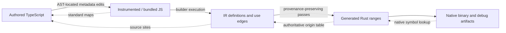

# Source maps and authored diagnostics

This is the source-mapping companion to [observability](observability.md), based on the [research record](research/source-maps.md). It defines planned support. The current compiler reports IR paths and emits Rust templates; it does not yet emit maps, capture exact authoring locations, map rustc diagnostics, or symbolize native failures into TypeScript.

## Recommended architecture

Use three connected layers:

1. **Standard source maps at JavaScript boundaries.** Preserve authored TS locations through metadata instrumentation, transpilation and bundling. Use AST analysis to find sites, MagicString for surgical edits, and established map tools for encoding, lookup and composition.
2. **Compiler-owned provenance from IR to Rust.** Carry immutable definitions, invocation/use edges and transform ancestry through passes. Record exact generated Rust ranges while emitting final text. This is the authoritative relationship for diagnostics and logical stacks; optionally project primary locations into version-3 source maps.
3. **Native symbols from machine addresses to Rust.** Debug artifacts locate generated Rust frames; the compiler range table can then locate their authored origins. Runtime logical frames use site IDs directly and do not require native symbolization, source text or sampled telemetry.

A map answers “where did this generated position come from?” A semantic origin also answers “which operation, which invocation, and why did it become this code?” Retain both. A single standard map cannot describe many-origin optimizations or distinguish two calls to a shared helper. Source mapping supplies the location machinery for observability, rather than becoming another execution model.

Map readers compose relationships backward. Each stage records output-to-input mappings; no stage assumes its input is the original TS file.

## Source and origin contracts

Extend the proposed observability records rather than introducing competing IDs. Exact public factories and wire schemas must be settled and versioned when implemented.

| Record            | Required meaning                                                                                                                                                                                    |
| ----------------- | --------------------------------------------------------------------------------------------------------------------------------------------------------------------------------------------------- |
| Source file       | Normalized workspace-relative path or explicit virtual URI, content digest and optional source text. URI alone is insufficient when revisions or virtual sources collide.                           |
| Source site       | File identity, optional half-open authored range, display name and producer/precision. Distinguish exact AST range, mapped point, explicit user annotation, best-effort captured frame and unknown. |
| Definition origin | Site that constructed the semantic operation/function/entity field, plus imported producer provenance when supplied.                                                                                |
| Use occurrence    | Parent/edge or invocation identity and its site, distinct from the shared node's definition.                                                                                                        |
| Transform origin  | Pass identity, input origins and chosen primary origin with a reason. Inlining, fusion and specialization preserve ancestry rather than overwriting it.                                             |
| Generated range   | Generated file identity/digest, half-open UTF-8 byte span, associated origins, optional use occurrence and mapping precision.                                                                       |
| Build manifest    | Schema/compiler/profile identity, input and artifact digests, source policy and symbol artifact references where selected.                                                                          |

Keep semantic operation identity independent of locations. Adding a label or relocating a file must not create a new operation or break Entity owner identity. A reused node may have one definition and many use occurrences; an occurrence wrapper or companion edge table carries metadata without mutating frozen IR. Deterministic occurrence IDs should be reproducible for the same inputs/profile, without promising stability through arbitrary edits. Distinguish those IDs from telemetry trace/span IDs and platform-native binary/debug IDs.

When multiple inputs contribute to generated code, preserve all origins and designate one primary location for simple viewers. A folded constant retains the expression's ancestry; a fused operation retains its component origins; shared Rust helpers retain definition origins and each call retains its use origin. Neither source content nor a v3 map can recover a missing executed occurrence after the fact. The runtime failure/logging adapter must carry it when the supported semantics need it.

### Coordinate units

Use typed position conversions at adapter boundaries. Never accept an ambiguous `column` or `offset` internally. Verify each parser's native span units and normalize them; an AST library may report UTF-8 bytes rather than JavaScript string offsets.

| Boundary                                        | Coordinates                                                                          |
| ----------------------------------------------- | ------------------------------------------------------------------------------------ |
| Normalized JS/TS and MagicString offsets        | Zero-based UTF-16 code units into the exact original JS/TS string                    |
| Raw v3 JavaScript mappings                      | Zero-based lines and UTF-16 columns                                                  |
| jridgewell `originalPositionFor` / `addMapping` | One-based lines, zero-based columns                                                  |
| Node `SourceMap.findOrigin`                     | One-based lines and columns; normalize the returned origin through an adapter        |
| Authored human diagnostics                      | One-based displayed lines/columns, derived from normalized source coordinates        |
| Generated Rust authoritative ranges             | Zero-based, half-open UTF-8 byte offsets into exact emitted bytes                    |
| rustc JSON                                      | Byte ranges plus one-based lines/Unicode-scalar columns; use byte ranges for mapping |
| Optional v3 projection for Rust                 | Explicitly documented zero-based UTF-16 line/column convention for our consumers     |
| Future Wasm standard maps                       | Byte-based generated positions; separate adapter                                     |

Rust is an unusual generated language for a v3 map. ECMA-426 allows other content types to differ; the optional Rust projection adopts an explicit convention and does not claim rustc uses it. Rust byte spans remain authoritative.

Preserve exact input text, including CRLF, BOM, astral characters and combining sequences. Cache line indexes per file revision and convert against that revision. UTF-8 bytes, UTF-16 units, Unicode scalar values and displayed graphemes can have different counts. Choose deterministic final Rust formatting/newlines before recording spans; a post-emission formatter invalidates them unless a verified additional mapping stage exists. Initial implementation should emit final formatted text directly, without running rustfmt after generating the map.

## Acquiring authored sites

Support a useful path without a frontend plugin: explicit immutable source/name annotations, consistent with the proposed `R.Source.at` / `R.Source.named` direction. These are API proposals, not exports. Validate ranges and distinguish caller assertions from parser-verified ranges. A function/entity name without a range is still useful and must not acquire a fictitious column.

Optional builder-stack capture is a fallback. Normalize engine frames and consult available JS maps, record precision and provenance, exclude internal helper frames, and retain an unknown/virtual location when resolution fails. A stack captured while a callback constructs IR identifies construction context; it is not a runtime Effect stack. Avoid making builds depend on engine-specific stack strings, installed globals or source-map availability.

An optional metadata plugin can make supported authoring sites exact:

1. Parse the supported module and resolve reffect import bindings, including recognized aliases and shadowing.
2. Find supported builder/function/use boundaries and retain original AST ranges.
3. Insert only metadata using immutable APIs; preserve evaluation order, callback count and semantic identity.
4. Return edited code and its source map to the host pipeline.
5. Attach a producer/file revision identity so ranges can be checked against the source snapshot.

This annotates existing supported R builders. It does not compile arbitrary operators, generators or ordinary TypeScript functions. Instrument only the requested target's reachable authoring modules, leaving browser/Foldkit client modules alone. Dynamic or ambiguous bindings require a documented fallback/refusal rather than a textual match on `R` or `Effect`. Oxc/Babel or a supported TypeScript parser API are candidates; choose a tested binding resolver for the actual pinned Vite+/Rolldown profile. MagicString itself supplies none of this analysis.

The first producer should prefer original TS before location-changing transforms. Where input is already transformed, trace its ranges through the host's upstream maps; record point precision if endpoints/containment cannot be established. Vite `enforce`/hook ordering alone does not guarantee original input across all loaders. Test the selected pipeline explicitly. Keep an adapter for standalone Node authoring as well: current examples use Node 24.19's transform-types mode, while whitespace-only stripping has different source-map needs.

## MagicString and map tooling

**Use MagicString for small AST-located source edits. Use a structured writer for Rust.** MagicString is optional tooling, not a compiler/runtime requirement.

A TS metadata transform can insert an annotation at a parser-verified original offset, preserving untouched source. `generateMap` or `generateDecodedMap` describes edited output relative to the input. Default line-level maps may be too coarse for a call-site diagnostic; select explicit `addSourcemapLocation` anchors or tested high-resolution mappings at important boundaries. `hires: true` increases size; `"boundary"` is an alternative to benchmark. Inserted annotation scaffolding does not automatically have exact authored meaning. Attribute it intentionally or leave it unmapped, and test emitted segments. Do not rely on upstream experimental range extensions.

Apply edits against one original snapshot, with overlap validation and deterministic ordering. If another stage edits the resulting string, use its new offsets and compose the maps. Reusing old offsets or overwriting an entire file with Rust does not preserve meaningful correspondence.

Reuse the jridgewell tools in compiler-side adapters:

- `@jridgewell/gen-mapping` for standard map encoding/projection.
- `@jridgewell/trace-mapping` for position lookup and standard/index-map reading.
- `@jridgewell/remapping` when the compiler owns composition across JS transforms.

For a Vite/Rollup-compatible transform, return `{ code, map }` and let the tested host compose its chain. Only perform additional compiler-side composition when consuming a map outside that host boundary; avoid flattening twice. A missing map after a position-changing transform makes exact upstream positions unavailable. An identity map is justified only when positions actually stay unchanged. Version and test adapters before adding dependencies; today MagicString is merely transitive, not a declared reffect API dependency.

## Emission and artifact layout

Replace mapping-critical template concatenation with a small structured source writer when implementing this slice. The writer tracks final UTF-8 offsets and line/column indexes, opens/closes origin scopes around emitted fragments and records ranges as it writes. Shared helper definitions and call expressions receive separate ranges. Internal runtime boilerplate, imports and glue receive explicit generated/internal status rather than inheriting the previous user's location.

Validate ranges against emitted file length, nesting/overlap policy and known origins. For lookup, prefer the most specific containing mapped range; consult parents only according to explicit ancestry/precision rules. Gaps remain unknown. A zero-width rustc span at a boundary needs a defined insertion-point rule; never automatically attach it to the previous user range. Macro expansion spans may resolve to an invocation or generated glue; retain expansion ancestry and all unresolved spans.

Proposed artifacts extend the observability layout:

| Artifact                            | Role                                                                                                                            |
| ----------------------------------- | ------------------------------------------------------------------------------------------------------------------------------- |
| `reffect.sources.json`              | Versioned source/site/origin/use tables and exact per-file generated ranges; authoritative diagnostics and logical-frame lookup |
| Build manifest                      | Artifact digests, profile/source policy, compiler inputs and optional native symbol references                                  |
| `src/lib.rs.map`, `src/main.rs.map` | Optional version-3 primary-origin projections for generic tooling; explicitly unmapped internal segments                        |
| Private source bundle               | Optional TS snapshots for developer/offline symbolication, separate from public production artifacts                            |
| Platform debug artifacts            | Optional DWARF/PDB/dSYM or supported split-debug outputs, matched to the native binary                                          |

Map the library and runner separately. Preserve a small coherent authoritative schema first; index-map emission, source scopes and multiple packaging layouts can wait for a consumer. Standard-map readers should accept supported index maps from upstream producers.

The current GeneratedFiles/Cargo writer accepts exactly Cargo.toml, lib.rs and main.rs. Implementation must extend this public artifact/write contract deliberately, with safe relative paths, deterministic bytes and overwrite policy, rather than adding a side write outside compiler services. Mapping/profile/content policy affects cache keys and manifest identity. Separate “build generated Rust with symbols” from “embed original TS”; debug symbols do not require public source contents. Avoid timestamps, absolute workspace paths or credentials in reproducible map identities.

## Diagnostics and runtime resolution

Compiler diagnostics resolve their IR path/node/use occurrence directly to source sites. Expose authored primary locations, related definition/use/transform locations, precision and the existing semantic diagnostic ID. Unknown positions preserve a useful function/entity name and IR path.

For native build failures, Cargo invokes build with its JSON message format and the adapter parses `compiler-message` envelopes. Translate rustc primary/related byte spans through the exact generated snapshot; keep the raw diagnostic, Rust ranges, codes, notes and macro-expansion context available. Not every native error should blame the user: unsupported lowering or generated invalid code is a compiler/backend defect with an authored explanation where available. Unknown or out-of-date maps fall back to native locations with an explicit reason.

Preserve Cargo artifact/build-script messages, unknown message kinds and process stderr. Cargo build parsing is separate from running the generated executable: scalar/typed-result stdout stays unchanged. A richer runtime diagnostic protocol requires its own versioned envelope; pretty diagnostics and logs remain on stderr.

A rustc suggested replacement targets generated Rust. Source maps locate its origins but rarely supply a semantics-preserving inverse edit. Do not offer it as a TS autofix unless a compiler-owned rule proves the rewrite preconditions. Migration tools consume mapped source diagnostics and their own registered fix metadata.

Runtime logging/failures should emit build/site/use IDs and bounded logical frames at the semantic failure boundary before unwinding. Offline/local rendering resolves IDs without network or OTel. Native stack capture is optional extra evidence: match binary/debug identity, resolve machine addresses into Rust, then consult the generated range table. Inlining, optimization and async task boundaries may lose native frames; debug info and maps cannot reconstruct logical fiber ancestry. GDB/LLDB, Cargo and Rust panic backtraces do not automatically read `.rs.map` files or display TypeScript. A custom offline resolver/editor adapter is the initial supported consumer.

## Resolution policy and production handling

Use a scoped resolver service rather than global stack interception. It accepts an explicit artifact/source root and trusted producer maps, supports embedded content when policy permits, normalizes map-relative source URLs and rejects unsupported schemes. Virtual module IDs and duplicate source URLs must remain distinguishable. Resolve query/fragment identities deliberately rather than silently stripping them.

No automatic fetching of arbitrary `sourceMappingURL` URLs during compilation, failure logging or symbolication. Explicitly configured remote artifact retrieval can be a later service. Bound map bytes, source-content bytes, nesting/composition depth and resolver caches; detect cycles, malformed VLQ, bad source indexes, traversal and missing files. Preserve the mapped URI/name with reduced precision if source text is absent. A nearest-segment lookup is a point approximation, not proof that an entire diagnostic range belongs to a source site.

Verify generated file digests before applying ranges. Verify available original snapshots before rendering snippets. A matching build revision alone is not sufficient to validate an arbitrary map file. Report stale/mismatched maps and keep the raw diagnostic; do not silently show the wrong source.

Development may embed `sourcesContent` and absolute paths only under explicit policy. Production defaults omit original source contents and use workspace-relative/virtual identifiers, with private map/source/symbol bundles available for controlled offline lookup. Stack/log/export records carry compact IDs and approved location summaries; avoid source text, arguments, raw module URLs or secret-bearing paths in OTLP. `ignoreList` can help viewers hide compiler/runtime frames, but it does not remove those sources or provide access control.

## Delivery through the existing milestones

| Stage                                    | Concrete slice                                                                                                                                                                             | Acceptance gate                                                                                                                                                                                            |
| ---------------------------------------- | ------------------------------------------------------------------------------------------------------------------------------------------------------------------------------------------ | ---------------------------------------------------------------------------------------------------------------------------------------------------------------------------------------------------------- |
| Next milestone 2 foundation              | Immutable explicit sites and use edges; pass ancestry; structured Rust writer; versioned authoritative ranges/manifest; source-aware compiler/rustc diagnostics and named logical failures | Independent authored-location fixtures, repeated/shared use sites, unknown/generated gaps and digest mismatch; unchanged typed errors/reference results/stdout; no new runtime dependencies for lookup IDs |
| Milestone 2–3 optional authoring adapter | AST-located metadata plugin, JS map lookup/composition and optional v3 Rust projections                                                                                                    | Real pinned Vite+/Node transform chains, import aliases/shadowing and callback counts; plugin-free builds still work; no widening of source syntax                                                         |
| Milestone 3 RPC deployment profiles      | Private artifact packaging, request/error source correlation and optional native debug/symbol resolver                                                                                     | Match binary and map identities, source-content redaction, useful unsampled failure IDs and bounded offline resolution                                                                                     |
| Milestones 6 and 11–12                   | Finalizer/interruption/fork/join logical frame provenance                                                                                                                                  | Executed frames/context isolation agree with supported Effect semantics; native map availability cannot determine semantic results                                                                         |
| Later target/frontend work               | Additional imported IR provenance, Wasm coordinates, frontend-specific exact producers                                                                                                     | Same versioned origin contract and target-specific map fixtures; do not invent exact ranges for producers that supply only names                                                                           |

The first implementation is provenance and emission, before the optional plugin. It can attach explicit sites to existing Boolean/u64 Effect functions and Foldkit entity/field origins without turning reffect into a general TS compiler. Add automatic convenience after the compiler can consume and preserve its metadata correctly.

### Required verification

- Use independently specified expected locations, including two expressions on one line, CRLF/BOM, emoji before a call and combining characters; verify both Rust byte ranges and TS UTF-16 positions.
- Compose at least two real JS transformations and check authored points; cover missing/partial maps, virtual files, index maps and explicitly unmapped generated gaps. Test boundaries so lower-biased point lookup cannot bleed into scaffolding.
- Share one IR node/helper across two call sites and fail only one branch. Report the executed use site and definition separately; keep frozen nodes, Entity identity and callback counts unchanged. Preserve ancestry through a real supported transformation when one exists.
- Inject a known invalid generated Rust type in a fixture and map the real Cargo/rustc JSON span to the intended authored site; preserve raw/related diagnostics and refuse inverse TS suggestions without a registered fix.
- Rebuild unchanged inputs in different workspace roots: emitted sources/maps are byte-identical under the same normalized profile. Mutated source/generated snapshots trigger mismatch handling. Check all emitted map/range references.
- Bound malformed/cyclic/oversized map processing and enforce resolver path/scheme policy. Test absent source text and production artifacts for source/path leakage.
- For a native symbol profile, exercise actual platform debug artifacts and known addresses. Assert useful fallback for missing symbols/optimized frames; avoid cross-platform assumptions about identical stack text.

Open implementation choices are exact schema/factory names, deterministic occurrence algorithm, parser/host API, map granularity and tested package/debug-tool versions. The three-layer boundary, explicit coordinate conversions, authoritative provenance, optional MagicString and honest precision/fallback behavior are the design decisions.
